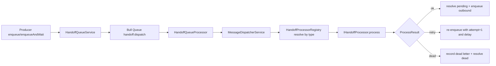
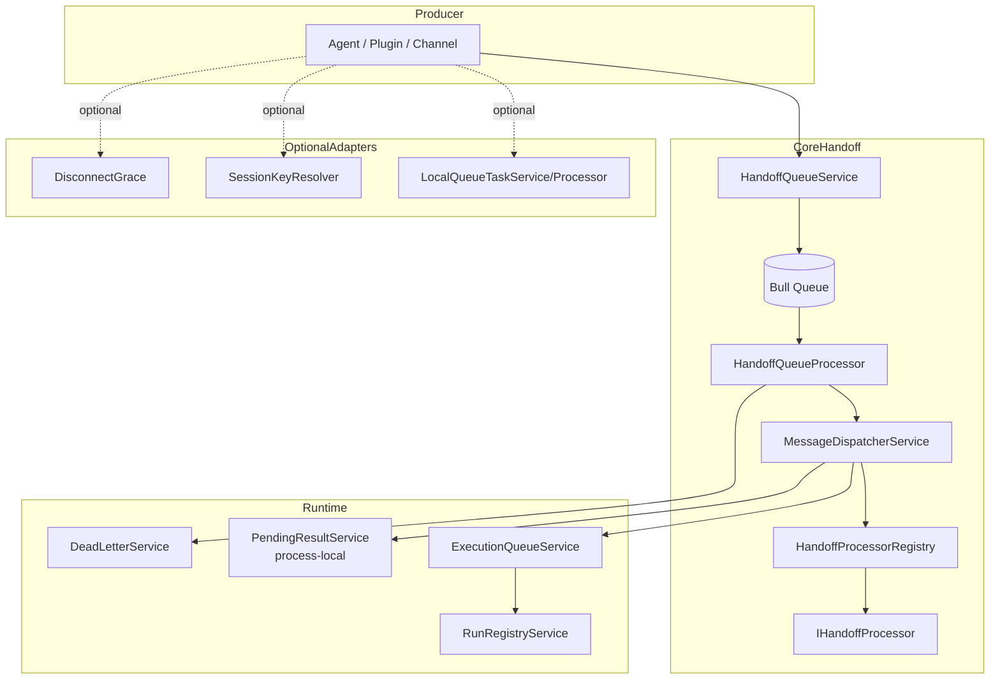

# Handoff 模块（智能体异步通讯通用队列管道）

## 1. 模块定位

`handoff` 是 `server-ai` 内部的**通用异步消息管道**，用于在智能体/插件/渠道任务之间进行解耦执行。
核心目标：

- 以统一消息信封（`HandoffMessage`）承载任务
- 通过 Bull 队列异步投递与消费
- 由 Processor 注册表按 `type` 分发到具体处理器
- 统一提供重试、超时、取消、死信、（进程内）等待结果能力

> 当前实现偏向“单实例或进程内最佳努力（best-effort）”语义，而非严格分布式一致回调。

---

## 2. 架构总览

### 2.1 主要组件

- **入口/导出层**：`index.ts` 导出全部 handoff 能力
- **运行时编排层**：`ExecutionQueueService` + `RunRegistryService`
  - 跟踪 in-flight run
  - 绑定 `AbortController`
  - 提供按 run/session/conversation/integration 取消
- **消息队列层**：`HandoffQueueService` + `HandoffQueueProcessor`
  - 入队（`enqueue` / `enqueueAndWait`）
  - 消费并调用调度器
  - 处理 `ok/retry/dead` 三态
- **调度分发层**：`MessageDispatcherService`
  - 校验消息信封
  - 按 `type` 从 `HandoffProcessorRegistry` 解析处理器
  - 统一执行策略（lane/timeout）
- **Processor 插件层**：`@HandoffProcessor(...)` + `HandoffProcessorRegistry`
  - 支持 discovery 与 StrategyBus 动态 upsert/remove
  - 支持 organization 作用域与全局回退
- **配套能力**：
  - `HandoffPendingResultService`：进程内等待/回调关联
  - `HandoffDeadLetterService`：死信记录（当前为日志）
  - `SessionKeyResolver`：按业务场景生成会话键
  - `LocalQueueTaskService/Processor`：将本地闭包任务包装为队列消息

### 2.2 数据流（简化）



### 2.3 执行语义

- `ProcessResult.status = ok`：可带 `outbound` 继续链式投递
- `retry`：按 `attempt/maxAttempts` 重投；耗尽后进入 dead letter
- `dead`：立即记死信
- `enqueueAndWait`：通过 `pendingResults` 做**进程内等待**（跨实例不保证回调可达）

---

## 3. 关键类型与协议

### 3.1 消息信封（`HandoffMessage`）

必填关键字段：

- `id`, `type`, `version`
- `tenantId`, `sessionKey`
- `businessKey`, `traceId`
- `attempt`, `maxAttempts`, `enqueuedAt`
- `payload`

可选字段：`organizationId`, `conversationId`, `headers`, `requestedLane`, `source` 等。

### 3.2 Processor 约定

- 接口：`IHandoffProcessor.process(message, ctx)`
- `ctx` 含 `runId`, `traceId`, `abortSignal`, `emit`
- 装饰器：`@HandoffProcessor({ types, policy: { lane, timeoutMs? } })`

### 3.3 消息类型命名建议

`processor/message-type.ts` 提供建议格式（例如 `channel.lark.inbound.v1`、`agent.handoff.v1`、`system.cancel.v1`），但运行时仍允许任意字符串 `type`，便于插件扩展。

---

## 4. 使用方法

### 4.1 模块接入

在应用模块导入 `ExecutionQueueModule`（`ServerAIModule` 已接入）。

### 4.2 定义一个 Processor

```ts
import { Injectable } from '@nestjs/common'
import { HandoffProcessor } from './processor/processor.decorator'
import { IHandoffProcessor, HandoffMessage, ProcessContext, ProcessResult } from './processor/processor.interface'

@Injectable()
@HandoffProcessor({
  types: ['agent.example.v1'],
  policy: { lane: 'subagent', timeoutMs: 30_000 }
})
export class ExampleProcessor implements IHandoffProcessor {
  async process(message: HandoffMessage, ctx: ProcessContext): Promise<ProcessResult> {
    if (ctx.abortSignal.aborted) {
      return { status: 'dead', reason: 'aborted' }
    }

    ctx.emit?.({ phase: 'running', id: message.id })

    return {
      status: 'ok',
      outbound: []
    }
  }
}
```

### 4.3 发送异步消息

```ts
await handoffQueue.enqueue({
  id: runId,
  type: 'agent.example.v1',
  version: 1,
  tenantId,
  sessionKey,
  businessKey: `agent:${runId}`,
  attempt: 1,
  maxAttempts: 3,
  enqueuedAt: Date.now(),
  traceId: runId,
  payload: { executionId },
  headers: {
    organizationId,
    userId,
    source: 'xpert',
    requestedLane: 'subagent'
  }
})
```

### 4.4 发送并等待结果（进程内）

```ts
const result = await handoffQueue.enqueueAndWait(message, {
  timeoutMs: 60_000,
  onEvent: (event) => {
    // 中间事件流
  }
})
```

## 8. 一页式精简架构图

下面是面向“智能体异步通讯通用队列管道”的最小心智模型（现状 + 建议分层）：



解读：

- **核心闭环**：`Queue -> Dispatch -> Processor -> Result`
- **运行治理**：`ExecutionQueue/RunRegistry` 提供取消、超时、查询
- **适配层**：`LocalTask/SessionKey/DisconnectGrace` 建议视作可插拔扩展，而非通用管道内核

## 消息架构

关键是把三层职责解耦：`queue`、`lane`、`message type` 各管一件事。

核心思路（先定边界）

- `queue`：做“物理隔离”和容量治理（不同资源池、不同 SLA、不同失败域）。
- `lane`：做“同一 queue 内的调度策略”（优先级、公平性、限并发、避免饿死）。
- `message type`：做“业务语义和处理逻辑”（由哪个 processor 处理、重试/超时策略是什么）。
推荐模型（3 维路由）

路由顺序：`message -> queue selector -> lane scheduler -> type dispatcher`。
信封字段建议最少包含：`type, queue, lane, priority, idempotencyKey, retryPolicy, timeoutMs, tenantId, traceId, orderingKey`。
设计原则：queue 决定“去哪排队”，lane 决定“怎么排”，type 决定“怎么处理”。
如何落地你提的 3 点

- 不同 queue 处理不同任务：按负载/SLA 划分，例如 realtime, batch, integration, critical。
- 单个 queue 内多 lane：例如 high, normal, low，用加权轮询 + 每 lane 并发上限（硬门控）。
- 不同 message type 不同处理：type -> processor registry + policy registry（每种 type 独立 timeout/retry/dead-letter 规则）。

关键工程点（不做会踩坑）

- 幂等：按 idempotencyKey 去重，至少一次投递 + 幂等消费。
- 重试：按 type 配置指数退避+抖动，不同错误分级（可重试/不可重试）。
- 死信：至少按 queue + lane + type 维度可查询、可重放。
- 可观测：指标必须带 queue/lane/type/tenant 标签，才能定位瓶颈。
- 配置化：路由规则建议放配置中心，不要硬编码在业务代码里。

一个直观例子

`agent.chat.v1 -> queue=realtime, lane=high, timeout=8s, maxAttempts=2`
`agent.report.build.v1 -> queue=batch, lane=normal, timeout=5min, maxAttempts=5`
`channel.lark.sync.v1 -> queue=integration, lane=normal, timeout=30s, maxAttempts=3`

## 可实施配置草案（Queue + Lane + Type 三层解耦）

目标：在不破坏现有 `HandoffMessage` 与 `enqueue/enqueueAndWait` API 的前提下，逐步支持更灵活的路由、调度与处理策略。

### 10.1 设计原则

- **Queue（物理隔离）**：决定消息进入哪个队列（资源池/SLA/失败域隔离）。
- **Lane（调度隔离）**：决定同一队列内如何公平调度与限并发（优先级、配额、背压）。
- **Type（语义隔离）**：决定由谁处理、超时多久、如何重试、是否可重放。

推荐执行链路：

`message -> queue selector -> lane scheduler -> type dispatcher -> processor`

### 10.2 HandoffMessage 扩展建议（向后兼容）

在现有信封基础上新增可选调度字段（默认值可由路由器补齐）：

```ts
interface HandoffMessageRoutingExt {
  queue?: string                     // 例: realtime | batch | integration | critical
  lane?: string                      // 例: high | normal | low
  priority?: number                  // 数值越小优先级越高（或反之，保持统一）
  orderingKey?: string               // 同 key 串行，保证局部顺序
  idempotencyKey?: string            // 幂等键（默认可退化为 businessKey）
  dedupeWindowMs?: number            // 去重窗口
  policyRef?: string                 // 指向 type policy 的逻辑名（可选）
}
```

兼容策略：

- 不传 `queue/lane` 时按 `type` 路由规则推断。
- 不传 `idempotencyKey` 时回退到 `businessKey`。
- 现有 `headers.requestedLane` 仍可保留，逐步迁移到顶层 `lane`。

### 10.3 路由规则 Schema（Queue 选择）

建议维护一份可热更新配置（DB/配置中心/文件均可）：

```yaml
version: 1
defaultQueue: realtime
defaultLane: normal

queues:
  realtime:
    bullQueueName: handoff:realtime
    maxInFlight: 200
  batch:
    bullQueueName: handoff:batch
    maxInFlight: 500
  integration:
    bullQueueName: handoff:integration
    maxInFlight: 150
  critical:
    bullQueueName: handoff:critical
    maxInFlight: 50

routes:
  - match:
      typePrefix: agent.chat.
    target:
      queue: realtime
      lane: high

  - match:
      typePrefix: agent.report.
    target:
      queue: batch
      lane: normal

  - match:
      typePrefix: channel.lark.
    target:
      queue: integration
      lane: normal

  - match:
      tenantTier: enterprise
      typePrefix: system.
    target:
      queue: critical
      lane: high
```

匹配顺序建议：

1. 精确 type > 2) type 前缀 > 3) tenant 标签 > 4) 默认路由。

### 10.3.1 v1 落地说明（当前实现）

- 默认模板文件：`packages/server-ai/src/handoff/config/handoff-routing.example.yaml`
- 实际配置路径环境变量：`HANDOFF_ROUTING_CONFIG_DEFAULT_PATH`
- 兼容旧环境变量：`XPERT_HANDOFF_ROUTING_CONFIG_PATH`
- 加载时机：服务启动时加载一次（v1 不支持热更新）
- v1 支持字段：
  - 顶层：`version`、`defaultQueue`、`defaultLane`、`queues`、`lanePolicy`、`typePolicies`、`routes`
  - `queues.<name>`：`bullQueueName`、`maxInFlight`
  - `lanePolicy.<name>`：`weight`、`maxConcurrent`、`maxQueued`、`mapToLane`
  - `typePolicies.<messageType>`：`queue`、`lane`、`timeoutMs`、`retry`、`idempotency`
  - `routes[].match`：`type`、`typePrefix`、`tenantId`、`organizationId`、`source`
  - `routes[].target`：`queue`、`lane`、`timeoutMs`
- `queue` 支持别名和全名：`handoff/default/realtime/batch/integration` 或 `handoff:*`
- `lane` 支持运行时 lane 与策略别名：`main/subagent/cron/nested` 以及 `high/normal/low`
- 配置校验：启动时进行 schema 校验，非法配置会阻止启动（fail-fast）

### 10.4 Lane 调度算法（单 Queue 内）

建议采用 **Weighted Round Robin + 每 lane 并发上限 + 背压阈值**：

```yaml
lanePolicy:
  high:
    weight: 5
    maxConcurrent: 40
    maxQueued: 1000
  normal:
    weight: 3
    maxConcurrent: 80
    maxQueued: 3000
  low:
    weight: 1
    maxConcurrent: 20
    maxQueued: 5000
```

执行建议：

- 消费器每轮按权重抽取 lane（高优先更多配额）。
- 同 lane 内按 `priority` + FIFO 出队。
- 若某 lane 超过 `maxQueued`，触发背压（限流/拒绝/降级队列）。
- 可选：同 `orderingKey` 在 lane 内串行，避免同业务键并发冲突。

### 10.5 Type Policy 模板（处理策略）

每个 `message type` 维护独立策略，避免“一刀切”：

```yaml
typePolicies:
  agent.chat.v1:
    queue: realtime
    lane: high
    timeoutMs: 8000
    retry:
      maxAttempts: 2
      backoff: exponential
      baseDelayMs: 300
      maxDelayMs: 5000
      jitter: full
      retryOn: [429, 500, 502, 503, 504]
    idempotency:
      keyFrom: idempotencyKey
      windowMs: 120000

  agent.report.build.v1:
    queue: batch
    lane: normal
    timeoutMs: 300000
    retry:
      maxAttempts: 5
      backoff: exponential
      baseDelayMs: 2000
      maxDelayMs: 60000
      jitter: equal
      retryOn: [500, 502, 503, 504]
    idempotency:
      keyFrom: businessKey
      windowMs: 86400000

  channel.lark.sync.v1:
    queue: integration
    lane: normal
    timeoutMs: 30000
    retry:
      maxAttempts: 3
      backoff: exponential
      baseDelayMs: 1000
      maxDelayMs: 20000
      jitter: full
      retryOn: [429, 500, 502, 503, 504]
```

### 10.6 最小改造步骤（建议）

1. **引入 RouteResolver**：`type -> queue/lane/policy` 解析器（默认可回退当前行为）。
2. **按 queue 拆 Bull 实例**：保留 `handoff`，新增 `handoff:realtime/batch/integration`。
3. **在 Processor 前加 LaneGate**：先做 in-process gate，再逐步外部化。
4. **统一 RetryEngine**：把重试策略从分散逻辑收敛到 policy 驱动。
5. **加 IdempotencyStore**：先 Redis（key + TTL），后续可迁 DB。
6. **补可观测标签**：日志/指标统一输出 `queue/lane/type/attempt/tenantId/traceId`。

### 10.7 参考伪代码（路由 + 调度 + 分发）

```ts
const route = routeResolver.resolve(message) // -> { queue, lane, policy }
await queueGateway.enqueue(route.queue, {
  ...message,
  lane: route.lane,
  policyRef: route.policy.name
})

const candidate = await laneScheduler.next(route.queue) // WRR + concurrency gate
const policy = policyRegistry.get(candidate.type, candidate.policyRef)

await retryEngine.execute(policy.retry, async () => {
  await idempotencyStore.ensure(policy.idempotency, candidate)
  await dispatcher.dispatch(candidate)
})
```

### 10.8 验收标准（面向三层能力）

- **Queue 层**：不同队列可独立扩容、独立观测、互不拖垮。
- **Lane 层**：高优 lane 在高负载下仍满足时延目标，低优 lane 不饿死。
- **Type 层**：不同 type 的 timeout/retry/idempotency 可独立配置并生效。
- **稳定性**：重试与死信可追溯到 `message.id + traceId`。
- **兼容性**：旧 producer 不改代码时仍能按默认规则正常运行。

### 10.9 Message Type 清单（当前实现 + 规划建议）

当前代码中已落地并被 processor 显式处理的类型：

- `agent.chat.v1`
  - 用途：`XpertController` 的聊天异步任务封装
  - processor：`AgentChatHandoffProcessor`
  - 备注：任务闭包仍由 `LocalQueueTaskService` 作为 process-local cache 托管

系统中建议统一采用的命名模式（用于后续扩展）：

- `agent.{action}.v{n}`
  - 示例：`agent.report.build.v1`
- `channel.{provider}.{action}.v{n}`
  - 示例：`channel.lark.sync.v1`
- `system.{action}.v{n}`
  - 示例：`system.cancel.v1`
- `plugin.{domain}.{action}.v{n}`
  - 示例：`plugin.billing.reconcile.v1`

建议：所有新类型先在 `typePolicies` 中声明 queue/lane/timeout/retry，再落 processor，避免默认路由导致行为漂移。
